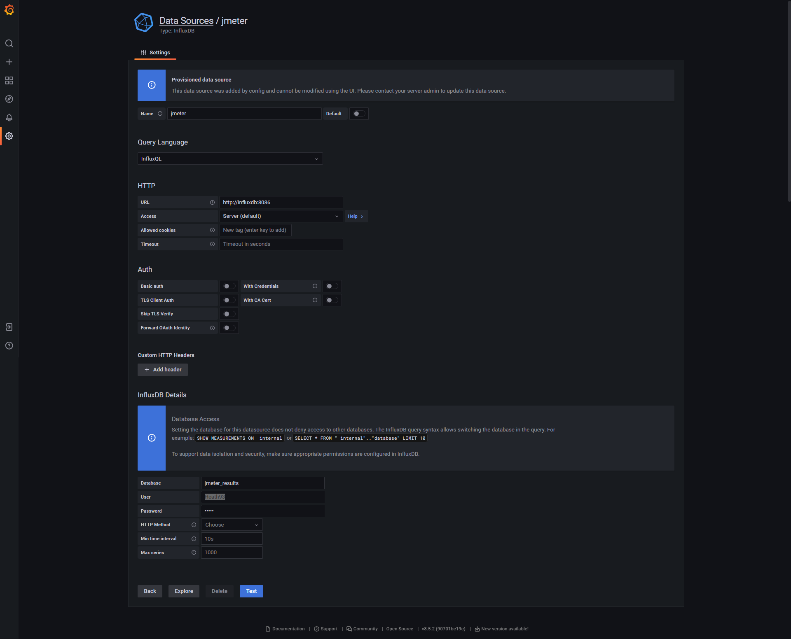

# 🧪 JMeter + InfluxDB + Grafana Integration Guide

## ⚙️ Backend Listener Configuration (JMeter)

| Parameter                | Value                                                                 |
|--------------------------|-----------------------------------------------------------------------|
| `influxdbUrl`           | `http://${__P(INFLUXDB_HOST, localhost)}:8086/write?db=jmeter_results` |
| `application`           | `${CLIENTNAME}_${STARTDATETIME}`                                       |
| `measurement`           | `jmeter`                                                               |
| `summaryOnly`           | `false`                                                                |
| `samplersRegex`         | `.*`                                                                   |
| `percentiles`           | `90;95;99`                                                             |
| `testTitle`             | `Test name`                                                            |
| `eventTags`             | *(leave blank or define tags)*                                         |

---

## 🖥️ Run JMeter Script on macOS/Linux

```bash
./run-specific-jmeter-script.sh example.jmx
````

---

## 🪟 Run JMeter Script on Windows

```powershell
.\run-specific-jmeter-script.ps1 example.jmx
```

---

## 📈 Grafana Dashboard

Open: [http://localhost:3000/dashboards](http://localhost:3000/dashboards)
Then click **"JMeter Dashboard"**


---

### 🔗 Import Dashboard Mẫu (ID: 5496)

1. Menu trái → `+` → **Import**
2. Nhập Dashboard ID: `5496` → **Load**
3. Chọn đúng Data Source bạn đã tạo → **Import**

---

## 🛢️ InfluxDB



---

## 📑 Generate JMeter HTML Report

```bash
jmeter -g jmeter-scripts/results/result.jtl -o jmeter-scripts/results/report
```


---

## 🎛️ Filter the Correct Test Run in Grafana

Filter theo format:

```
CLIENTNAME + STARTDATETIME
```


